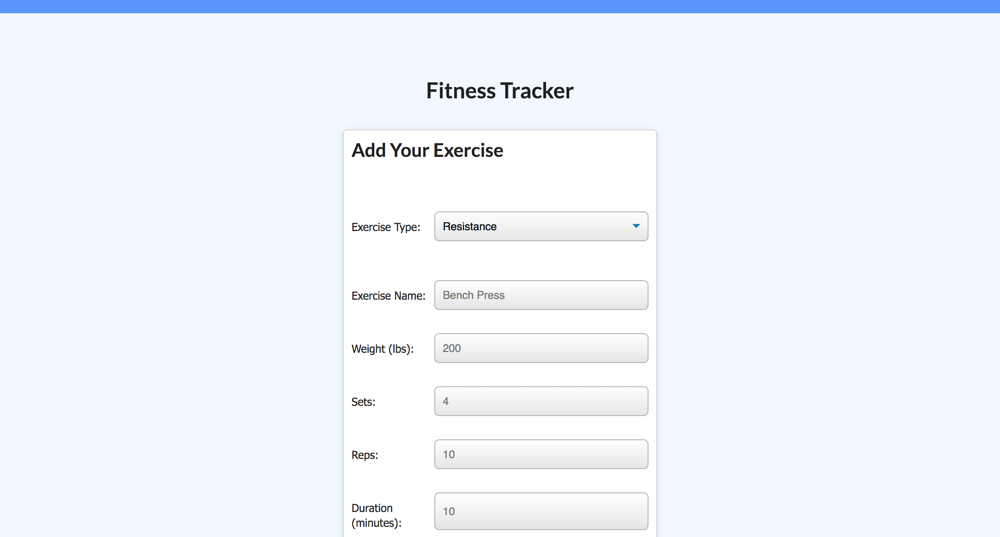

# Workout Tracker 

# Description

Created Mongo database with a Mongoose schema and handle routes with Express to use Workout Tracker.

# Table of Contents

- [Installation](#installation)
- [Usage](#usage)
- [Contributed](#contributed)
- [License](#license)
- [Questions](#questions)

# Installation

npm install

# Usage

Add and keep track of workouts.

# Contributed

Contributers: Jose Orozco

# License

This application is protected under conditions of the MIT license.

# Questions

My Github Profile: http://www.github.com/jose8160  
 If there are any questions contact
Jose816orozco@gmail.com
